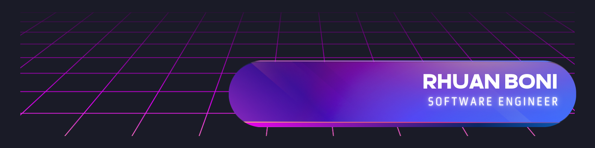

 

## About me 
Atualmente, sou graduando em **Engenharia de Software** no **Instituto Federal de São Paulo (IFSP)**, campus **São Carlos**. Minha trajetória na tecnologia é marcada por uma busca constante por unir a teoria acadêmica com a prática do mercado. Atuo, no momento, como **Estagiário de Desenvolvimento Fullstack**, onde aplico conhecimentos em **Node-RED** para soluções de integração e desenvolvimento **Mobile** com **Flutter**. No ambiente mobile, tenho me aprofundado em arquiteturas que suportam operações com mapas e autenticação offline utilizando SQLite e módulos de atualização customizados, empregando comunicação de dados em ambiente offline a partir de tecnologias Bluetooth, como BLE para comunicação entre dispositivos Android e Bluetooth Serial para Arduinos.

Minha base técnica é sólida no ecossistema Java, ferramenta principal em minha Iniciação Científica. No projeto, trabalho no desenvolvimento de um módulo multiusuário para um objeto de aprendizagem gamificado (baseado em Truco) destinado ao ensino de Computação. O foco é permitir partidas entre usuários e coletar dados para o futuro treinamento de IAs, utilizando Java, Spring Boot e WebSockets para o back-end e a mesma tecnologia com React.js para o front-end. Além disso, possuo experiência com bancos de dados SQL (PostgreSQL) e NoSQL (MongoDB), sempre buscando construir sistemas escaláveis e eficientes.

#### English Version 

I am currently an undergraduate student in Software Engineering at the Federal Institute of São Paulo (IFSP), São Carlos campus. My path in technology has been defined by a constant pursuit of bridging academic theory with industry practice. I work as a Fullstack Development Intern, where I apply my knowledge of Node-RED for integration solutions and of Mobile development with Flutter. On the mobile side, I have been deepening my expertise in architectures that support map-based operations and offline authentication using SQLite and custom update modules, relying on offline data communication through Bluetooth technologies—such as BLE for communication between Android devices and Bluetooth Serial for Arduinos.

My technical foundation is solid within the Java ecosystem, the main tool in my undergraduate research project. In this project, I am developing a multi-user module for a gamified learning object (based on the card game Truco) aimed at teaching Computing. The goal is to enable matches between users and collect data for the future training of AI models, using Java, Spring Boot, and WebSockets for the back-end, and the same stack with React.js for the front-end. In addition, I have experience with SQL (PostgreSQL) and NoSQL (MongoDB) databases, always aiming to build scalable and efficient systems.

## Skills 

 
 
 
 
 

 
 
 

 
 

 
 
 
 

## Github Status 
| |  |
| :-: | :-: |

|  |  |  
| :-: | :-: | :-: |

## Connection 

 
   
 

